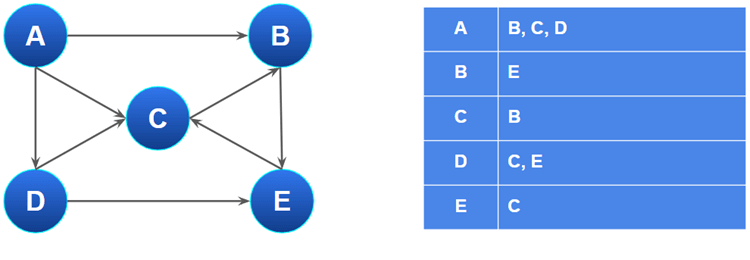

## Grafos

### Ejercicio 122

> Defina los términos: grafo, grafo dirigido (o digrafo), cuándo un vértice es adyacente a otro, peso (o coste) de un grafo, camino, longitud de un camino, bucle en un grafo, ciclo, camino simple, grafo acíclico (o DAG), grafo conexo, grafo fuertemente conexo, grafo débilmente conexo y grafo completo.

- **Grafo**: Un **grafo** es una **estructura de datos** compuesta por un conjunto de **vértices** (o nodos) y un conjunto de **aristas** (o enlaces) que **conectan pares de vértices**.

    Puede ser representado como `G = (V, E)` donde **V** es el conjunto de **nodos** y **E** el conjunto de **aristas**

    Un grafo **no es lineal** porque sus elementos NO estan organizados de manera SECUENCIAL, cada elemento puede estar conectado a **0, 1 o VARIOS** otros elementos, lo que permite **multiples relaciones / caminos posibles** entre ellos

    

- **Grafo dirigido**: Grafo en el que **las aristas tienen una dirección**, es decir, **cada arista** va de un **vértice origen** a un **vértice destino**.

- **Vertice adyacente a otro** = si **existe una arista** que los **conecta directamente**.

- **Peso (/coste) de un grafo**: **Valor numérico** asignado a **cada arista** que representa el costo, distancia asociada a **recorrer esa arista**.

- **Camino**: **Secuencia de vértices** en la que cada par consecutivo está conectado por una arista.

    

- **Longitud de un camino**: Número de aristas que **forman el camino**.

- **Bucle en un grafo** : **Arista** que conecta un vértice **consigo mismo**.

    

- **Ciclo**: **Camino cerrado** en el que el **primer y último** vértice **coinciden** y no se repite ninguna arista ni vértice, salvo el primero y el último.

    

- **Camino simple**: Camino en el que **no se repite** ningún **vértice** (excepto posiblemente el primero y el último, si es un ciclo.)

- Grafo **acíclico** (o DAG): Grafo **dirigido** que **no contiene ciclos**.

    

- Grafo **conexo**: Grafo **no dirigido** en el que existe **al menos 1 camino** entre cualquier **par de vértices**.

- Grafo **fuertemente conexo**: Grafo conexo en el que existe un **camino dirigido** entre cualquier par de vértices en **ambos sentidos**.

    

- Grafo **débilmente conexo**: Grafo dirigido que, **al ignorar la dirección de las aristas**, es conexo.

    

### Ejercicio 123

> Explique diferentes implementaciones que se pueden utilizar
para la estructura de grafo.

Unas de las maneras principales con las que se puede implementar un grafo, son las siguientes:

- **Matriz de adyacencia**: Se utiliza una matriz cuadrada donde las filas y columnas representan los vérticess del grafo. El valor en la posición **(i,j)** indica si existe una arista entre el vértice **i** y **j** (tambien se podría almacenar el **peso** si el grafo es **ponderado**)

    

- Lista de adyacencia: **Cada vértice** tiene asociada una **lista (o coleccion / set)** que contiene los vértices **a los que está conectado directamente**.

    

Tambien existen otras maneras de implementar grafos, menos comunes, como una lista de aristas por ejemplo.

### Ejercicio 124

> Sea el grafo de la figura 2. Se pide:

> Realizar la traza de la búsqueda en profundidad de una ruta que vaya de A a I. Muestre cómo van evolucionando la pila, la tabla con la solución provisional y el árbol. ¿Cuándo se realiza vuelta atrás (backtracking)?

> Realizar la traza la búsqueda en amplitud de una ruta que vaya de A a I. Muestre cómo van evolucionando la cola, la tabla con la solución provisional y el árbol

> ¿Qué estructuras de las mencionadas en los apartados 1 y 2 se implementan realmente y cuál es puramente conceptual en este ejercicio?

### Ejercicio 125

> Sea un grafo con los siguientes vértices: "Albacete", "Almería", "Madrid", "Murcia", "Segovia" y "Toledo", y con los siguientes arcos:
>
- **Madrid-Segovia**: 92 km
- **Segovia-Toledo**: 165 km
- **Madrid-Toledo**: 72 km
- **Madrid-Albacete**: 257 km
- **Albacete-Toledo**: 245 km
- **Albacete-Murcia**: 146 km
- **Murcia-Almería**: 218 km
- **Toledo-Almería**: 500 km

> Se pide ejecutar en papel el algoritmo de Dijkstra para obtener el mejor
camino desde Madrid a cualquiera de las demás ciudades.

### Ejercicio 126

> Analice la complejidad temporal asintótica de los siguientes
algoritmos:

> 1. Cálculo del camino entre dos vértices mediante búsqueda en profundi-
dad.
> 2. Cálculo del camino entre dos vértices mediante búsqueda en anchura.
> 3. Algoritmo de Dijkstra